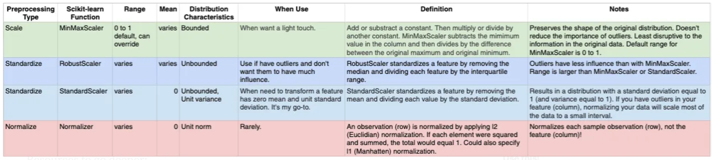

# ML_UnSupClust_KMean
exploring KMean algo over clustering set of songs to related playlists
### Types of Scalers and Transformers

### useful links
https://scikit-learn.org/stable/modules/preprocessing.html
https://scikit-learn.org/stable/auto_examples/preprocessing/plot_all_scaling.html
